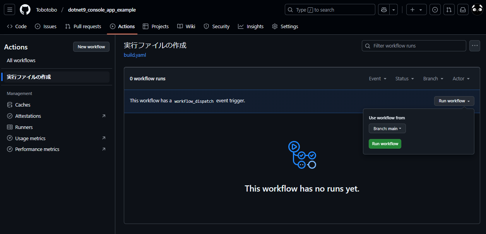
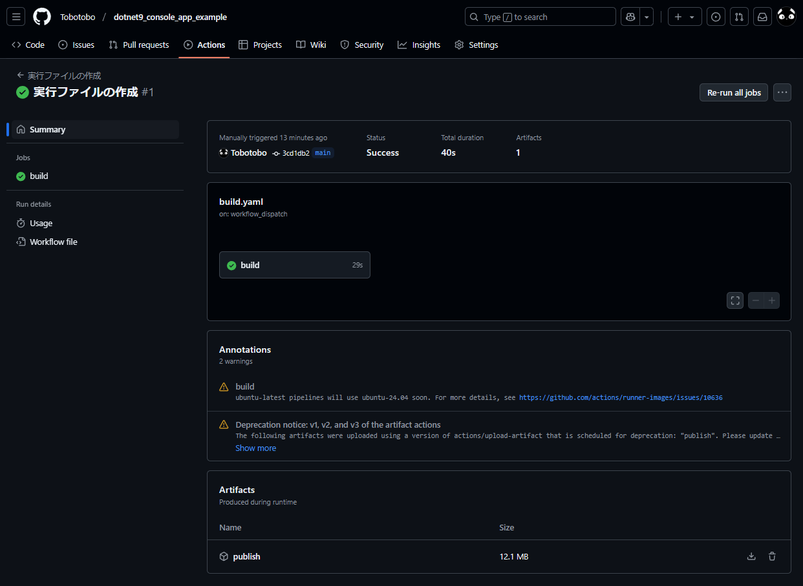
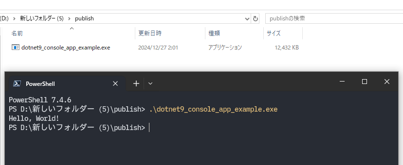
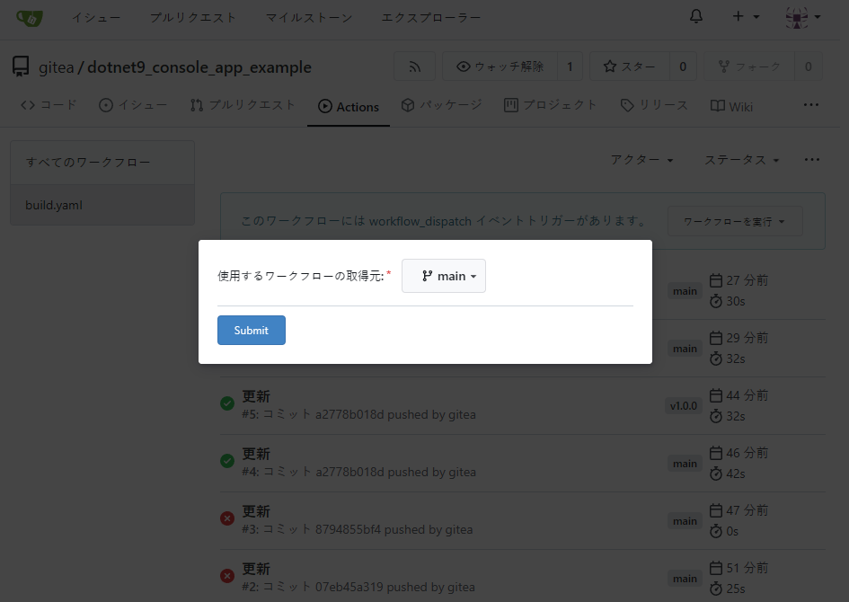
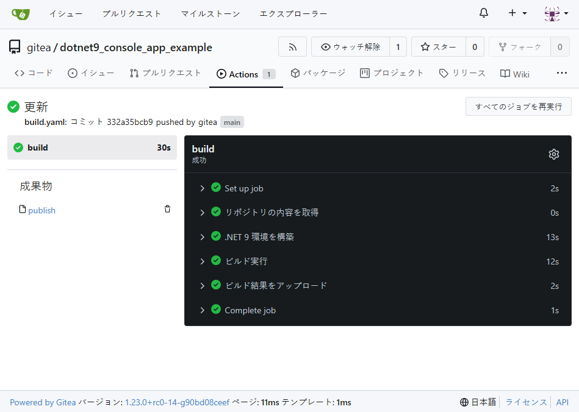

# dotnet9_console_app_example

## 概要

本リポジトリは、.NET 9 のコンソールアプリについて  
GitHub Actions を使って Windows の実行ファイル作成するサンプルです。

なお、Gitea Actions でも同様に動作します。  
※ワークフローの手動実行(workflow_dispatch)に Gitea v1.23.0-rc0 以上が必要

## イメージ
ワークフローを実行すると `dotnet9_console_app_example.exe` が入った `publish.zip` をダウンロードできる。  

`publish.zip` を解凍して `dotnet9_console_app_example.exe` を Windows 環境で実行できる。  
※クロスコンパイルできている。

Gitea でも同じように実行できる。

